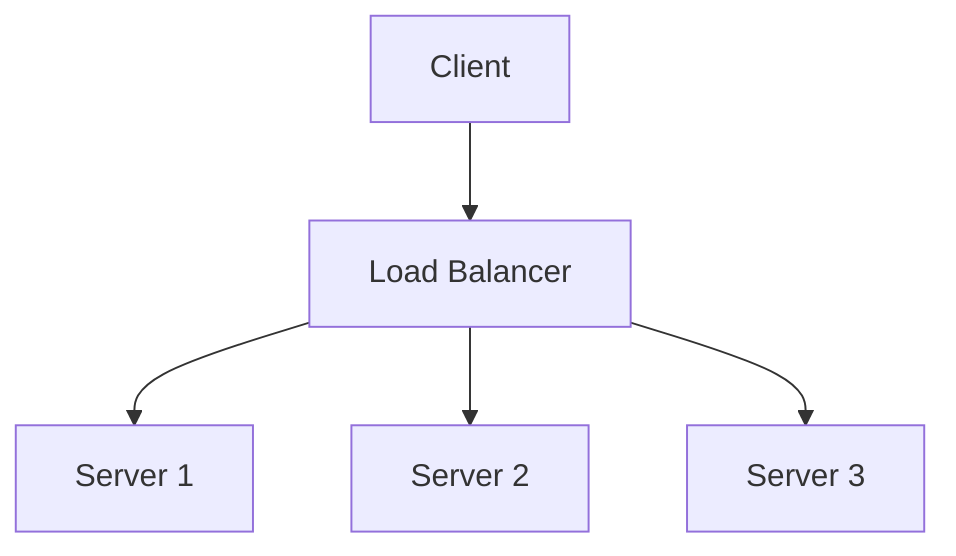

# Project Overview

This repository contains a set of Python scripts demonstrating basic HTTP server functionality, including load balancing and client-server interaction. The project is designed to help students understand key concepts in networking and load balancing.

## Components

### 1. Client File (`client.py`)

The `client.py` file demonstrates how to interact with the HTTP servers. It sends requests to the servers and displays the responses. This file is used to test the functionality of the servers and the load balancer.

### 2. Server Files (`server1.py`, etc.)

The server files implement HTTP servers that can be configured to respond with different data, authentication mechanisms, and ports. The core server script is `server1.py`, which can be instantiated with different configurations. 

- **Basic Server (`server1.py`):** A customizable HTTP server that supports Basic Authentication and includes a checksum for response integrity.
- **Multiple Instances:** You can run multiple server instances with different settings using the `server_manager.py` script.

### 3. Load Balancer File (`load_balancer.py`)

The `load_balancer.py` file implements a simple load balancer that distributes incoming requests among multiple server instances. It handles server failures by rerouting traffic to healthy servers, demonstrating basic fault tolerance in load balancing.

## System Architecture



The system architecture includes the following components:

- **Client:** Sends HTTP requests to the load balancer.
- **Load Balancer:** Distributes requests among available servers and handles server failures.
- **Servers:** Respond to requests with configured data and perform authentication.

## Extra Credit

**For each meaningful pull request (PR) contributed to this repository, students will receive extra credit points on their homework grade.** Contributions should aim to improve functionality, fix bugs, or enhance the documentation. Ensure your PRs are well-documented and include a clear description of the changes made.

## How to Contribute

1. Fork the repository and clone your fork.
2. Create a new branch for your changes.
3. Implement your changes and test them thoroughly.
4. Submit a pull request with a detailed description of your changes.

We appreciate your contributions and look forward to your improvements!

## Getting Started

1. **Clone the Repository:**
```
   git clone https://github.com/your-repo.git
```

2. **Install Dependencies:**
   Ensure you have Python installed. No additional dependencies are required.

3. **Run Servers and Load Balancer:**
   - Start server instances using `server_manager.py`:
```
     python server_manager.py
```
   - Start the load balancer using `load_balancer.py`:
```
     python load_balancer.py
```   
- Use `client.py` to test interactions with the servers:
```
     python client.py
```

4. **Explore and Experiment:**
   - Modify server configurations in `server1.py` and `server_manager.py`.
   - Add new features or improve existing ones in the scripts.
   - Test the load balancer's behavior under different scenarios, including server failures and varying loads.
